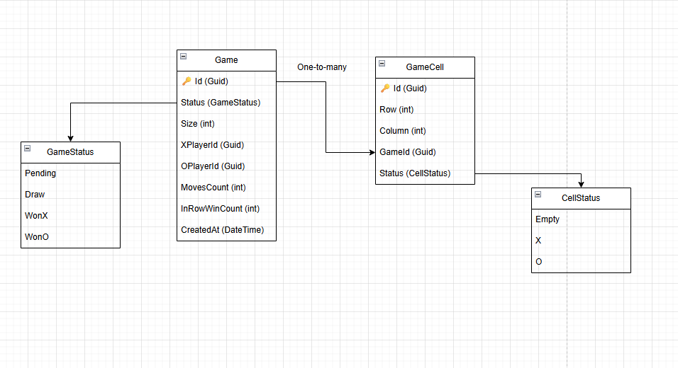

# Описание решения тестового задания

## Структура проекта


- `TicTacToeBank` - слой API
- `TicTacToeBank.Application` — слой приложения
- `TicTacToeBank.Core` — доменная область, логика самой игры
- `TicTacToeBank.DatabaseAccess` — слой взаимодействия с БД (PostgreSQL)
- `TicTacToeBank.Test` — юнит и интеграционные тесты
- `TicTacToeBank/README.md` — описание проекта

## Стек
- .NET 9
- ASP.NET Core
- EF Core
- PostgreSQL
- AutoMapper
- xUnit
- Test Containers

## Быстрый старт

1. Клонируйте репозиторий
2. Запустите движок Docker
3. Соберите проект - `docker-compose build`
4. Запустите приложение - `docker-compose up -d`
5. Перейдите на `http://localhost:5062/swagger/index.html`
6. Для редактирования настроек игры следуюет изменять файл `appsettings.json`:
```
{
  "Logging": {
    "LogLevel": {
      "Default": "Information",
      "Microsoft.AspNetCore": "Warning"
    }
  },
  "AllowedHosts": "*",
  "ConnectionStrings": {
    "TicTacToeDbContext": "Host=localhost;Port=5432;Database=tictactoe;Username=postgres;Password=123"
  },
  "GameSettings": {
    "BoardSize": 3,
    "WinningLength": 3
  }
}
```
где `BoardSize` - размер поля, `WinningLength` - количество подряд идущих символов, необходимых для победы (максимально 5, как прописано в описании `Game`). Размер доски от 3 до бесконечности.


## Описание схемы БД


## Описание эндпоинтов
- GET `api/health` - вернет код 200, если приложение работает
- GET `api/game/{id}` - возвращает игру с ID `id` или 404. Тело ответа: 
```
{
  "id": "3fa85f64-5717-4562-b3fc-2c963f66afa6",
  "size": 0,
  "status": 0,
  "xPlayerId": "3fa85f64-5717-4562-b3fc-2c963f66afa6",
  "oPlayerId": "3fa85f64-5717-4562-b3fc-2c963f66afa6",
  "inRowWinCount": 0,
  "cells": [
    {
      "id": "3fa85f64-5717-4562-b3fc-2c963f66afa6",
      "row": 0,
      "column": 0,
      "gameId": "3fa85f64-5717-4562-b3fc-2c963f66afa6",
      "status": 0
    }
    ...
  ]
}
```
- POST `api/games` - создает игру с двумя игроками. Тело запроса:
```
{
  "xPlayerId": "3fa85f64-5717-4562-b3fc-2c963f66afa6",
  "oPlayerId": "3fa85f64-5717-4562-b3fc-2c963f66afa6"
}
```
ID игроков следует сгенерировать.
Тело ответа:
```
{
  "id": "3fa85f64-5717-4562-b3fc-2c963f66afa6",
  "xPlayerId": "3fa85f64-5717-4562-b3fc-2c963f66afa6",
  "oPlayerId": "3fa85f64-5717-4562-b3fc-2c963f66afa6"
}
```
- POST `api/games/{id}/moves` - сделать ход. Тело запроса:
```
{
  "playerId": "3fa85f64-5717-4562-b3fc-2c963f66afa6",
  "row": 0,
  "column": 0
}
```

Тело ответа:
```
{
  "message": "string",
  "gameId": "3fa85f64-5717-4562-b3fc-2c963f66afa6",
  "success": true
}
```
## Общее описание и некоторые принятые решения
- За основу взята Чистая Архитектура
- Для обеспечения рандома в 10% написан `RandomProvider`, который передает в доменный метод `MakeMove` булевую переменную, говорящую, будет ли в этот ход подмена знака.